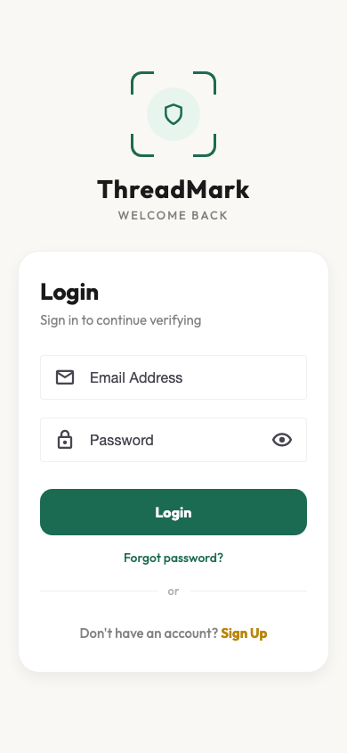
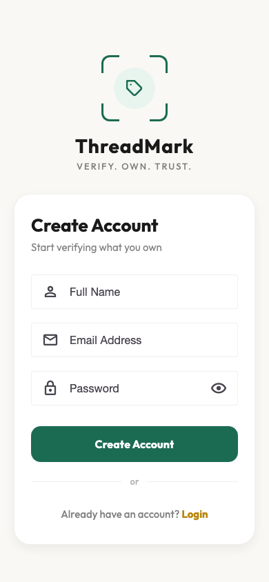
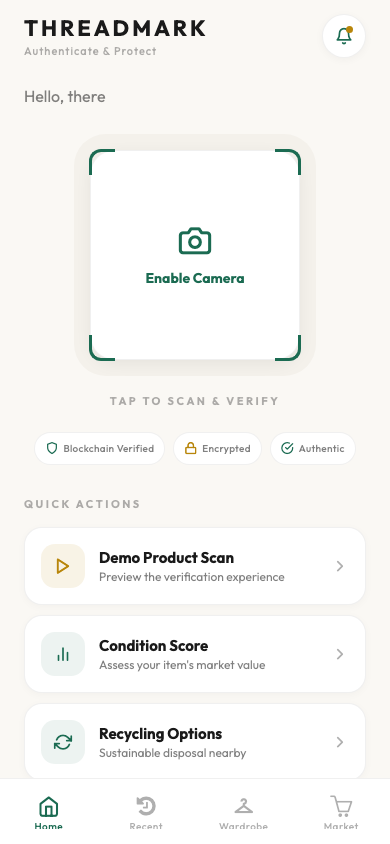
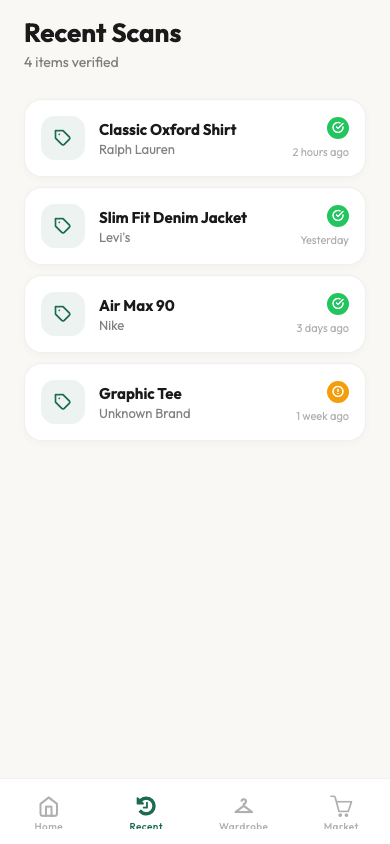
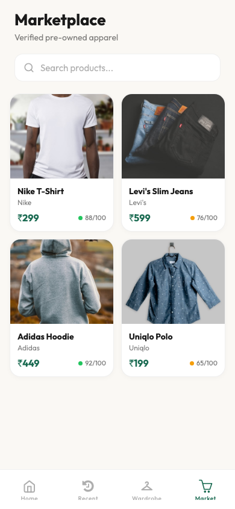
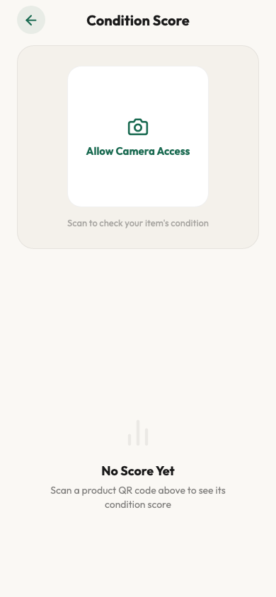
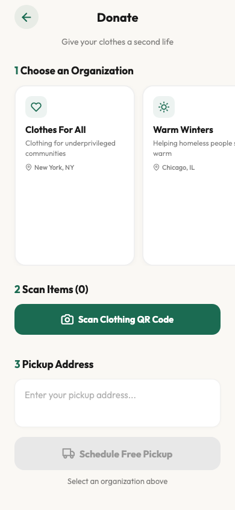
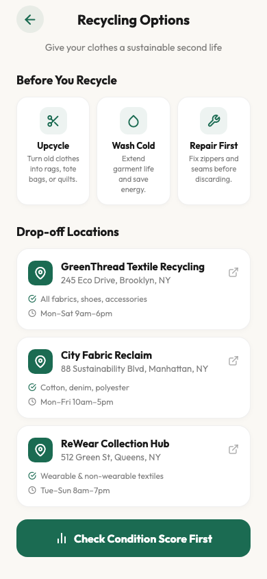

# ThreadMarks

A mobile app for verifying apparel authenticity using blockchain. Scan a QR code on any tagged garment, and the app pulls its metadata from IPFS to confirm it's genuine — with a full chain-of-custody timeline from manufacture to resale.

Built with React Native (Expo SDK 54), Firebase, and Thirdweb.

## Screenshots

<p align="center">
  
  
  
  
</p>
<p align="center">
  
  
  
  
</p>
<p align="center">
  
</p>

## What it does

- **QR Scan & Verify** — scan an encrypted QR code on a garment, decrypt it, fetch product metadata from IPFS, and display a verified product page with confetti animation
- **Chain of Custody** — timeline showing manufacture date, blockchain verification, ownership claims, and transfer history
- **Ownership Transfer** — claim ownership of a verified product using your order ID
- **Wardrobe** — track all your verified items in one place
- **Marketplace** — browse and trade authenticated apparel
- **Condition Score** — assess an item's current condition and market value based on age, material, and category
- **Recycling Options** — find sustainable disposal options nearby
- **Donate** — scan and donate verified items to give them a second life

## Tech stack

| Layer | Tech |
|-------|------|
| Mobile app | React Native, Expo SDK 54, TypeScript |
| Navigation | Expo Router (file-based) |
| Auth | Firebase Authentication |
| Blockchain | Thirdweb SDK (NFT minting, storage) |
| Decentralized storage | IPFS via Pinata gateway |
| QR encryption | CryptoJS (Base64 + reverse encoding) |
| UI | React Native Paper, Lottie animations |

## Getting started

```bash
# clone
git clone https://github.com/Nevil1234/ThreadMarks.git
cd ThreadMarks

# install
npm install

# set up env vars
cp .env.example .env
# fill in your Thirdweb client ID and secret key

# run
npx expo start
```

Scan the QR code with Expo Go on your phone, or press `a` for Android / `i` for iOS simulator.

## Project structure

```
app/
  (tabs)/          # tab screens — home, recent, wardrobe, marketplace
  login/           # login screen
  signup/          # signup screen
  product.tsx      # verified product details + chain of custody
  ScanClothing.tsx # QR scanner for donation flow
  ConditionScore.tsx
  RecyclingOptions.tsx
  Donate.tsx
  WardrobeItem.tsx
config/            # Firebase config
context/           # React context (user state)
constants/         # colors, theme
photos/            # app screenshots
```

## How verification works

1. User scans a QR code on a garment
2. QR data is decrypted (reversed Base64)
3. The decrypted IPFS URI is validated and the CID is checked
4. Product metadata is fetched from IPFS via Pinata gateway
5. Product details, images, and chain-of-custody timeline are displayed
6. User can claim ownership by entering their order ID

## License

MIT
