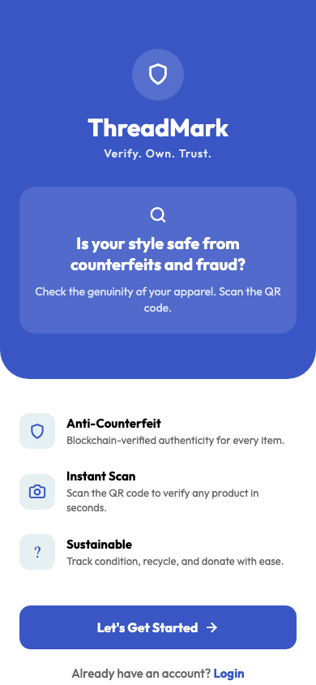

# ThreadMarks — Apparel Authenticity Verifier

A React Native (Expo) mobile app that verifies apparel authenticity using blockchain. Scan the QR code on any tagged garment, and the app pulls its metadata from IPFS to confirm it's genuine — with a full chain-of-custody timeline from manufacture to resale.

## Features

- **QR scan & verify** — Scan an encrypted QR code on a garment, decrypt it, fetch product metadata from IPFS, and display a verified product page with confetti animation
- **Chain of custody** — Timeline showing manufacture date, blockchain verification, ownership claims, and transfer history
- **Ownership transfer** — Claim ownership of a verified product using your order ID
- **Wardrobe** — Track all your verified items in one place with condition scores and estimated resale value
- **Marketplace** — Browse and trade authenticated apparel with search and filters
- **Recent scans** — History of all scanned items with authentic / unverified status badges
- **Condition score** — Assess an item's current condition and market value based on age, material, and category
- **Recycling & donate** — Find sustainable disposal options nearby, or scan and donate verified items

## Tech Stack

| Layer | Tech |
|-------|------|
| Framework | React Native 0.81 + Expo 54 + TypeScript |
| Navigation | Expo Router (file-based routing) |
| Auth | Firebase Authentication |
| Database | Cloud Firestore |
| Blockchain | Thirdweb SDK (NFT minting, storage) |
| Decentralized storage | IPFS via Pinata gateway |
| QR encryption | CryptoJS (Base64 + reverse encoding) |
| UI | React Native Paper, Lottie animations, Outfit font family |
| Camera | expo-camera (barcode scanning) |

## Getting Started

```bash
# Clone
git clone https://github.com/Nevil1234/ThreadMarks.git
cd ThreadMarks

# Install dependencies
npm install

# Set up env vars
cp .env.example .env
# Fill in your Thirdweb client ID and secret key

# Start the dev server
npx expo start

# Run on iOS simulator
npx expo start --ios

# Run on Android emulator
npx expo start --android
```

Scan the QR code with Expo Go on your phone, or press `a` for Android / `i` for iOS simulator.

## Project Structure

```
app/
├── (tabs)/
│   ├── _layout.tsx          # Tab bar (Home, Recent, Wardrobe, Market)
│   ├── home.tsx             # QR scanner + greeting + trust badges
│   ├── recent.tsx           # Scan history with status indicators
│   ├── wardrobe.tsx         # Verified items collection
│   └── marketplace.tsx      # Authenticated apparel listings
├── login/
│   └── index.tsx            # Login screen
├── signup/
│   └── index.tsx            # Registration screen
├── _layout.tsx              # Root stack navigator + font loading
├── index.tsx                # Landing page (onboarding hero)
├── product.tsx              # Verified product details + chain of custody
├── ScanClothing.tsx         # QR scanner for donation flow
├── ConditionScore.tsx       # Item condition assessment
├── RecyclingOptions.tsx     # Sustainable disposal options
├── Donate.tsx               # Donate verified items
└── WardrobeItem.tsx         # Individual wardrobe item detail
config/
└── firebaseconfig.tsx       # Firebase init + auth persistence
context/
└── UserDetailContext.tsx     # User state (React Context)
constants/
└── Colors.ts                # Design tokens (emerald/gold palette)
assets/
├── fonts/                   # Outfit font family (bold, medium, regular)
├── images/                  # App logo, splash assets
└── animations/              # Lottie animation files
```

## How Verification Works

1. User scans a QR code on a garment tag
2. QR data is decrypted (reversed Base64 via CryptoJS)
3. The decrypted IPFS URI is validated and the CID is checked against known formats
4. Product metadata is fetched from IPFS via the Pinata gateway (5s timeout)
5. Product details, images, and chain-of-custody timeline are displayed with a confetti animation
6. User can claim ownership by entering their order ID

## Firebase Data Model

**Firestore collections:**
- `users/` — user profiles keyed by email (name, email, created date)

**Authentication:**
- Email/password auth with platform-specific persistence (AsyncStorage on mobile, localStorage on web)

## Deliberate Simplifications

- QR encryption is a reversed Base64 encoding, not production-grade crypto. Swap for AES or RSA for real anti-counterfeit use.
- Wardrobe and marketplace use hardcoded demo data. Connect to Firestore for persistent user collections.
- Condition scoring uses a simple formula based on age, material, and category. A real implementation would use image analysis or expert assessment.
- Ownership transfer logs to console only. Wire up to a smart contract for on-chain transfers.

## Screenshots

| Landing | Sign Up | Login |
|---------|---------|-------|
|  |  |  |

| Home | Recent Scans | Wardrobe |
|------|-------------|----------|
|  |  |  |

| Marketplace | Condition Score | Recycling |
|-------------|-----------------|-----------|
|  |  |  |

| Donate |
|--------|
|  |

## License

MIT
